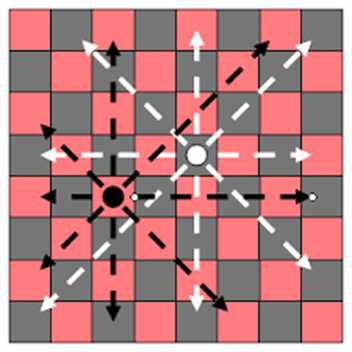

# N-Queen Problem

In this paper, we represent a program or solution for n queen problem.The main idea of this problem is to place N queens on an NxN chessboard such that no two queens attack each other.
Traditionally, algorithm has been written for serial computation recent advances in software and hardware allow parallelism.The key idea is to define a matrix which will have placed the queens on the diagonal of that matrix and then find all the permutations of that NxN matrix.In the end we only need to check if the queens are colliding with each other and if not that will be a positive result.
Through this, we demonstrate how to solve the problem sequential, with multiple threads and multi-threading and with message passing between multiple single- threaded processes (MPI).

## Intro

The classic combinatorial problem is to place eight queens on a chessboard so that no two attack. This problem can be generalized as placing n non-attacking queens on an NxN chessboard. Since each queen must be on a different row and column, we can assume that queen i is placed in i-th column. All solutions to the n- queens problem can therefore be represented as n-tuples that are permutations of an n-tuple. Position of a number in the tuple represents queen's column position, while its value represents queen's row position (counting from the bottom) Using this representation, the solution space where two of the constraints (row and column conflicts) are already satisfied should be searched in order to eliminate the diagonal conflicts.

Two queens not attacking each other shown on Image 1.

We need a simple method for finding conflicts now.Observing the diagonals now for every permutated matrix we have time complexity of O(n2).

## Design 

Now to parallelize our computation we need to find a way or decide how to divide the work among several threads(workers). Assuming that we have a fixed number of workers throughout the program execution, it would be the easiest to assign exactly one region of the resulting image to each worker.
This choice is reasonable, since then each worker would only need to store the data in the region it is responsible for, and nothing else.
The main idea is to distribute expensive tasks across slaves (controlled by a master process) to be executed in parallel.Still, care must be taken when choosing the block size, as it has to be small enough to ensure a balanced usage of all workers, but at the same time, large enough not to spend most of the CPU time on worker communication and organization overhead.
Every worker will get a permutation from the identity matrix like the one on the image below (Image 2).Then the worker is checking for all positioned queens if they are attacking each other if not that is one of the solution so send it to the solution bag. If not than throw it away and get a new task or new permuted matrix.

## Problem Description 

`Serial mode`: This is the most basic mode, that uses a single thread for everything. First should load the job specification.While generating permutations from identity matrix of queens the generated permutations must be checked by the main thread each one of it for possible positive results which will be saved and printed in the console that is how we will find all possible solutions for this part.

`Parallel (multi-threaded) mode`: Here, the job loading and splitting part is the same as in the serial mode. While generating the permutations we are sending them in an already created threads pool with fixed number of threads depends on each processor performance, it should spawn some worker threads and coordinate job division between them some kind of blocked queue of tasks for the threads or the workers. When the pool get a task some threads get that first task and start with execution also the others workers are waiting for other tasks. Whe a worker finish his job or task then he waits for another till the pool is not shutdown after adding the last task for the workers. After the worker threads have finished their work with checking if the task is the solution and adding to the solution bag they are in sleep mode.

`Distributed (MPI) mode`:
In this mode, we have to have at least two processes running, the server and at least one worker. The server handles the job loading and splitting part, and waits for job requests from the workers. The workers should in turn request jobs from the server, and process them.
Here we have to divide again the bag of tasks or permutations to each different processor. While creating them the server or the first processor is sending task for each of the processors to check and save the result. Each of them will have to do the same job or checking if that permuted matrix is positive result or not and bring back the result together.
When they finish their job they send back response and the program is executed.

## Comparison of all three versions

While testing the all three different part of codes we can conclude that the parallel solution for this problem has the best time elapsed in execution the program for four different N in NxN matrix. On the first place is parallel next comes the sequential and in the end the worst elapsed time is for the MPJ or the third part of the program.

| Sequential | Parallel | Distributed |   N |
|:-----------|:--------:|------------:|----:|
| 145ms      |  109ms   |      1021ms |   8 |
| 534ms      |  426ms   |      7512ms |   9 |
| 3931ms     |  3107ms  |     86940ms |  10 |
| 52137ms    | 47136ms  |    880513ms |  11 |

## Conclusion

As can be seen from the results, the presented algorithm works the best when we parallelize the way of running this program for solving this problem.Begin with best result for sequential and ends with the best time.

## To run this example:

1. For the sequential part run the `Sequentional.java`
2. For the parallel part run the `Parallel.java`
3. For the distributed part you should download and set environment variable for MPJ on your machine or include it through maven then uncomment Distributed.java and run it

Video -> https://www.youtube.com/watch?v=p_SUbcf0nCk
